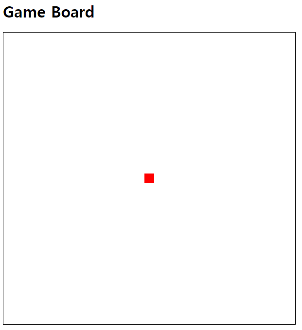

## 작성 목적

2개 이상의 방향키가 눌렸을 때 이동 방향을 갱신하는 방법을 학습하기 위해 작성되었습니다.

## 해설

1. 플레이어의 위치는 붉은 사각형으로 표시되며, 검은색 격자 좌상단 모서리부터의 상대적인 X, Y 거리로 표현됩니다.
2. 2개 이상의 방향키가 눌렸을 때 대각선 방향으로 이동하는 기능을 구현했습니다.
3. 정확히는 `keydown` 이벤트가 발생했을 때 매 프레임마다 해당 방향으로 위치가 갱신되고, `keyup` 이벤트가 발생했을 때 위치 갱신이 멈추도록 구현했습니다.
4. 예를 들어, 좌+상 방향키가 눌렸을 때 왼쪽 위 방향으로 이동하도록 구현했습니다.
5. 따라서 좌+우 방향키가 눌렸을 때 제자리에 멈추어 있습니다.

## `requestAnimationFrame` 함수

`requestAnimationFrame` 함수는 브라우저에게 수행하기를 원하는 애니메이션을 알리고, 다음 리페인트가 진행되기 전에 해당 애니메이션을 업데이트하는 함수를 호출하도록 요청합니다.

`setInterval`, `setTimeout`의 작동이 브라우저의 리페인트 주기와 동기적이지 않아서, 브라우저가 리페인트를 할 때까지 기다리지 않고, 브라우저의 리페인트 주기에 맞춰 애니메이션을 업데이트하는 최적화가 적용되어 있습니다. 자세한 내용은 아래 참고 자료를 꼭 읽어 보시면 좋을 것 같습니다.

[참고 자료 : 웹 애니메이션 최적화 requestAnimationFrame 가이드](https://inpa.tistory.com/entry/%F0%9F%8C%90-requestAnimationFrame-%EA%B0%80%EC%9D%B4%EB%93%9C)

## 다음 목표

### Server Overwhelming 방지 대책 연구

화면을 부드럽게 그리는 것은 `requestAnimationFrame`으로 수행할 수 있었습니다만, `movePlayer` 함수 내부에 서버에 해당 플레이어의 위치 갱신을 알리는 코드가 포함되면 프레임이 반복되는 속도와 같은 속도로 서버에 요청을 보내게 됩니다.

이는 서버에 부하를 주게 되므로, 서버의 부하를 최소화하며 플레이어의 위치를 갱신하는 방법을 연구해야 합니다. 아마 화면 갱신과는 별개로 서버에 위치 갱신을 알리는 방법을 연구해야 할 것입니다.

### 플레이어 이동 방식 변경

현재 매 프레임마다 `speed`만큼 위치가 갱신되고 있는데, 게임 화면을 격자로 구성하는 경우 '초당 N칸 이동'과 같이 플레이어의 이동을 다른 방식으로 계산해야 합니다. 작성 시점(20240711)을 기준으로 게임이 진행될 맵 화면을 표현할 자료 구조가 결정되지 않아 다른 부분을 먼저 연구해보면 좋을 것 같습니다.